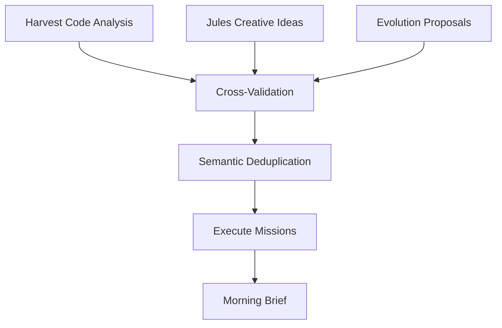

# 🤖 Jules Integration - Autonomous Development Agent

> **Trinity's brother.** An autonomous coding agent (Google Jules API) that writes code, repairs bugs, and evolves the system during night hours.

---

## 📁 Complete Structure (23 files, ~250KB)

```
jules/
├── heart.py             # Core worker job (34KB, 685 lines)
├── nightly_council.py   # Nightly pipeline (27KB, 678 lines)
├── jules_client.py      # Jules API client (23KB)
├── forge.py             # Mission execution (23KB)
│
├── persistence.py       # State persistence (18KB)
├── harvest.py           # Code analysis (13KB)
├── staging.py           # Staging workflow (13KB)
├── self_review.py       # PR self-review (12KB)
├── git_ops.py           # Git operations (11KB)
│
├── cortex.py            # Session management (8KB)
├── gate.py              # Access control (7KB)
├── nightwatch.py        # Night monitoring (5KB)
├── git_controller.py    # Git controller (5KB)
│
├── pending_manager.py   # Pending tasks (9KB)
├── planning_critic.py   # Plan validation (3KB)
├── options_manager.py   # Options (3KB)
├── architect.py         # Architecture analysis (3KB)
├── sandbox.py           # Test sandbox (3KB)
├── sanitizer.py         # Code sanitization (3KB)
│
├── api.py               # REST endpoints (15KB)
├── github_client.py     # GitHub integration
└── config.json          # Configuration
```

---

## 🧠 Core Components

### JulesJob (heart.py)
The main worker that monitors and manages Jules tasks:

```python
class JulesJob:
    """Worker job for Google Jules API."""
    
    async def _watch_loop(self):
        # Poll for updates on active tasks
        # Handle refinements (max 5 per task)
        # Manage system probation
        # Trigger sandbox tests
```

### Nightly Council
Autonomous nightly pipeline that improves Trinity:

```python
class NightlyCouncil:
    """The Committee that sleeps not."""
    
    async def convene(self):
        # 1. Fetch Jules Ideas (creative projects)
        # 2. Fetch Harvest Cache (code analysis)
        # 3. Fetch Evolution Proposals
        # 4. Cross-validate with Gemini Pro
        # 5. AUTO-EXECUTE: Send top 3 to Forge
        # 6. Morning: User finds staged projects
```

---

## 🌙 Nightly Pipeline



### Quota-Based Execution
```python
TARGET_SUCCESS = 3   # PRs per night
MAX_ATTEMPTS = 10    # Prevent infinite loops

# Continue until quota met OR pool exhausted
while successes < TARGET_SUCCESS and attempts < MAX_ATTEMPTS:
    result = await forge.execute(mission)
    if result.success: successes += 1
```

---

## 🔧 Key Features

| Feature | Module | Purpose |
|---------|--------|---------|
| **Harvest** | `harvest.py` | Analyzes codebase for improvements |
| **Forge** | `forge.py` | Executes coding missions |
| **Staging** | `staging.py` | Manages staging branch workflow |
| **Self-Review** | `self_review.py` | AI reviews its own PRs |
| **Sandbox** | `sandbox.py` | Tests changes in isolation |

---

## 🔄 Workflow

1. **Night**: Nightly Council convenes
2. **Analysis**: Harvest scans codebase for issues
3. **Planning**: Council validates and prioritizes
4. **Execution**: Forge launches Jules missions
5. **Review**: Self-review validates changes
6. **Staging**: Changes staged for human review
7. **Morning**: User finds PRs ready for merge

---

## 🔗 Integration with Trinity

```python
# From brain/dreaming.py
async def rem_cycle(self):
    # Auto-healing: delegate fixes to Jules
    for error in recurring_errors:
        await jules.create_mission(
            goal=f"Fix: {error.message}",
            files=error.affected_files
        )
```

---

## 📊 State Persistence

Stored in `memories/jules/`:

| File | Purpose |
|------|---------|
| `morning_brief.json` | Overnight results for UI |
| `refinement_counts.json` | Retry state per task |
| `evolution_proposals.json` | Self-improvement queue |
| `pending_tasks.json` | Active task tracking |

---

> **Key Insight**: Jules is Trinity's autonomous developer - working through the night to improve and repair the system. The Nightly Council governs what gets built, ensuring quality through AI cross-validation.
