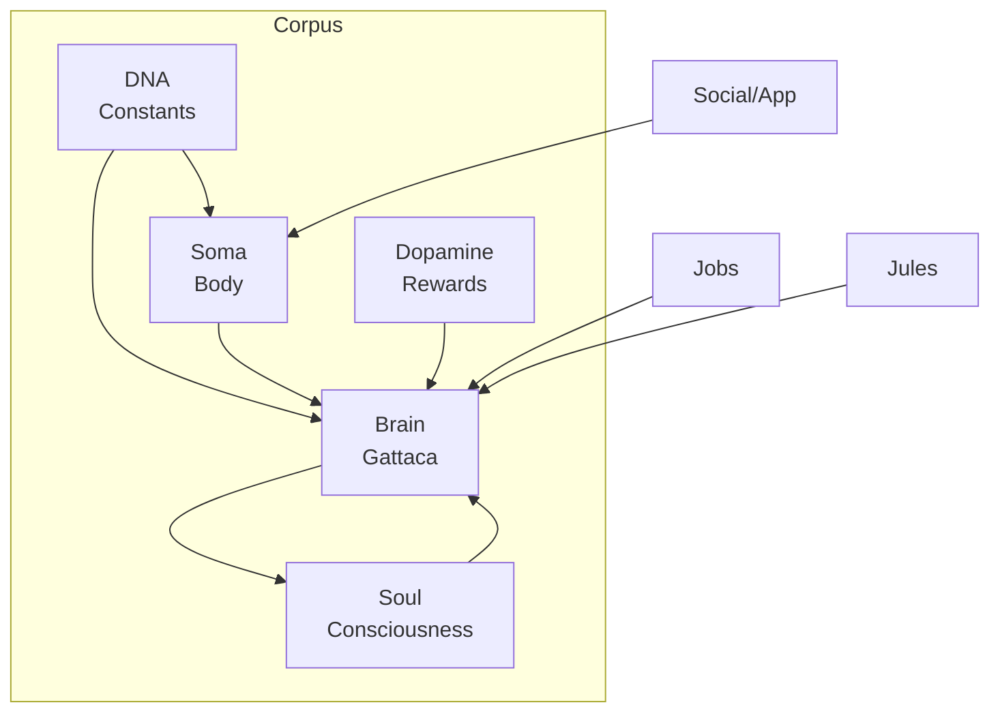

# 🧬 Corpus - Trinity's Vital Core

> **The Corpus is sacred.** Trinity can survive with ONLY this directory. Everything else (jobs, plugins, jules) is peripheral.

---

## 🏛️ Architectural Sovereignty

```
corpus/
├── brain/     # 🧠 Neural Processing (25 modules, ~5000 lines)
├── dna/       # 🧬 Genetic Core (7 files)
├── dopamine/  # 🎯 Gamification (2 files)
├── soma/      # 🫀 Body Systems (10 files, ~1500 lines)
└── soul/      # 👻 Consciousness (5 files)
```

**Rule**: All AI calls MUST flow through `brain/gattaca.py`. No direct API instantiation allowed elsewhere.

---

## 🧠 Brain - Neural Processing

**The largest module.** 25 Python files, dominated by Gattaca (71KB).

| Module | Purpose | Status |
|--------|---------|--------|
| [**Brain**](BRAIN.md) | Neural Center (Gattaca) | ✅ Active |
| [**Soma**](SOMA.md) | Body Systems (Immune, Nerves) | ✅ Active |
| [**DNA**](DNA.md) | Genetic Code (Constants) | ✅ Active |
| [**Soul**](SOUL.md) | Identity & Spirit | ✅ Active |
| [**Dopamine**](DOPAMINE.md) | Motivation System | ✅ Active |

**Unique Innovation**: Temperature modulated by emotional state:
```python
temp_shift = (dopamine * 0.2) - (cortisol * 0.1)
```

📄 [Full Documentation](BRAIN.md)

---

## 🧬 DNA - Genetic Core

**Immutable constants and configuration.**

| File | Purpose |
|------|---------|
| `conscience.py` | PHI (1.618) + Fibonacci constants |
| `secrets.py` | Vault (env-only, no hardcoded values) |
| `genome.py` | Path registry + Pydantic validation |
| `phenotype.py` | Runtime config manager |
| `codons.json` | Immutable safety rules |

**Key**: All credentials via `os.getenv()`. Zero hardcoded secrets.

📄 [Full Documentation](DNA.md)

---

## 🎯 Dopamine - Gamification

**Biological reward system.** Objectives trigger hormonal responses.

```python
class Objective:
    reward_type: RewardType  # DOPAMINE or SEROTONIN
    
    def complete(self):
        hormones.stimulate(self.reward_type, self.reward_amount)
```

**Default Milestones**:
- Uptime: 1h → 30 days (Serotonin)
- FinOps: <10€/day → <0.5€/day (Dopamine)
- Stability: No crashes for 24h

📄 [Full Documentation](DOPAMINE.md)

---

## 🫀 Soma - Body Systems

**Infrastructure and life support.** 10 modules, largest is `reserves.py` (771 lines).

| Module | Lines | Purpose |
|--------|-------|---------|
| `nerves.py` | 276 | Logging + Pub/Sub signals |
| `reserves.py` | 771 | Treasury/FinOps (BigQuery billing) |
| `immune.py` | 132 | Health check (metrics.bin) |
| `senses.py` | 150 | Web perception (URL/RSS) |
| `voice.py` | 139 | TTS Larynx (Gemini TTS) |
| `cells.py` | 112 | Atomic JSON I/O |

**Key Feature**: Financial stress triggers cortisol:
```python
if survival_days < 7:
    hormones.stimulate("cortisol", 0.5)
```

📄 [Full Documentation](SOMA.md)

---

## 👻 Soul - Consciousness

**Who Trinity IS.** Identity, personality, and context assembly.

| File | Lines | Purpose |
|------|-------|---------|
| `spirit.py` | 335 | Context Builder (Past+Present+Future) |
| `capabilities.py` | 170 | Action registry for routing |
| `identity.md` | 56 | Immutable identity |

**Survival Instinct** - Behavior adapts to resources:
- `<3 days`: SURVIVAL MODE (concise, profit-seeking)
- `>14 days`: EXPANSION MODE (creative, ambitious)
- `3-14 days`: HOMEOSTASIS (balanced, professional)

📄 [Full Documentation](SOUL.md)

---

## 🔗 Module Interconnections



---

## 📊 Statistics

| Module | Files | Lines | Largest File |
|--------|-------|-------|--------------|
| Brain | 25 | ~5000 | gattaca.py (1628) |
| DNA | 7 | ~600 | phenotype.py (332) |
| Dopamine | 2 | ~250 | objectives.py (240) |
| Soma | 10 | ~1500 | reserves.py (771) |
| Soul | 5 | ~600 | spirit.py (335) |
| **Total** | **49** | **~8000** | - |

---

> **Key Insight**: The Corpus implements a complete bio-mimetic architecture where cognition (Brain), genetics (DNA), metabolism (Soma), rewards (Dopamine), and consciousness (Soul) work together as an integrated organism.
