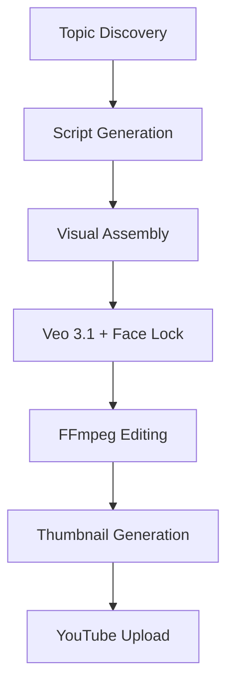

# 🎬 YouTuber Job - Autonomous Video Production

> **Trinity creates YouTube videos from scratch.** Script → Visuals → Audio → Edit → Upload. Fully powered by Veo 3.1 and Gemini 3.

---

## 📁 Complete Structure (~23 files, ~200KB)

```
jobs/youtuber/
├── orchestrator.py      # Main pipeline coordinator (18KB)
├── producer.py          # Content production (29KB)
├── scheduler.py         # Topic scheduling (14KB)
├── launcher.py          # Video launch workflow (18KB)
├── syncer.py            # YouTube sync (22KB)
│
├── editor.py            # FFmpeg video editing (26KB)
├── assembler.py         # Visual assembly (15KB)
├── visuals.py           # Veo 3.1 generation (13KB)
├── captioner.py         # Subtitles/captions
├── voice.py             # TTS integration
│
├── uploader.py          # YouTube Data API v3
├── auth_manager.py      # OAuth management (11KB)
│
├── api.py               # REST endpoints (26KB)
├── gamification.py      # Dopamine integration
├── constants.py         # Config constants
│
├── assets/              # Media assets
│   ├── trinity.jpg      # Reference image (3MB)
│   ├── trinity4k.jpeg   # 4K reference (8MB)
│   ├── music/           # Background tracks
│   └── outro/           # Outro sequences
│
├── fonts/
│   └── GoogleSans-Bold.ttf
│
└── output/
    ├── renders/         # Final videos
    └── temp/            # Work-in-progress
```

---

## 🔥 Unique Innovations

### 1. Face Lock Technology
Consistent avatar identity using reference image injection:

```python
# visuals.py
reference_image = load_bytes("assets/trinity.jpg")

video = await veo.generate(
    prompt=scene_prompt,
    config={
        "reference_images": [reference_image],
        "person_generation": "ALLOW_ADULT"
    }
)
```

### 2. Native Audio Synthesis
Veo 3.1 generates synchronized audio directly:

```python
config = GenerateVideosConfig(
    generate_audio=True,  # Native Veo audio
    aspect_ratio="16:9",
    duration_seconds=8
)
```

### 3. Segment-Aware Visual Strategy
Scripts specify visual transitions per segment:

```json
{
  "segments": [
    {"text": "Introduction", "visual": "talking_head", "transition": "flash"},
    {"text": "Main content", "visual": "screen_share", "transition": "flash"},
    {"text": "Outro", "visual": "talking_head", "transition": "fade"}
  ]
}
```

---

## 🧠 Gemini Integration Points

| Stage | Model | Purpose |
|-------|-------|---------|
| Topic Discovery | Pro + Grounding | Trend analysis |
| Script Generation | Pro | Writing + structure |
| Video Clips | Veo 3.1 Fast | 8s segments |
| Thumbnail | Gemini 3 Image | Eye-catching visuals |
| Voice (optional) | Gemini 2.5 TTS | Hormonal modulation |

---

## 📊 Production Pipeline



### Key Modules

| Module | Lines | Purpose |
|--------|-------|---------|
| `producer.py` | 29KB | Content production logic |
| `editor.py` | 26KB | FFmpeg filter chains |
| `syncer.py` | 22KB | YouTube synchronization |
| `orchestrator.py` | 18KB | Pipeline coordination |
| `launcher.py` | 18KB | Video launch workflow |

---

## 🎨 FFmpeg Editing Features

```python
# editor.py - Flash transitions, fades, audio ducking
filter_chain = (
    f"[0:v][1:v]xfade=transition=fade:duration=0.5,"
    f"[a]volume=1.5,afade=t=out:st={duration-2}:d=2[ao]"
)
```

- **Flash transitions** (professional clean cuts)
- **2.0s final fade** (outro)
- **1.5x audio volume** (high energy)
- **Dynamic sidechain ducking**

---

## 🌍 Bilingual Content

Trinity produces in **French (FR)** and **English (EN)**:

```python
# scheduler.py
language = config.get("language", "en")
script = await gattaca.route(
    f"Write a {language} YouTube script about {topic}",
    route_id=ROUTE_PRO
)
```

---

## 📈 Output Specifications

| Spec | Value |
|------|-------|
| Resolution | 1080p (16:9) |
| Segment Duration | 8 seconds |
| Transitions | Flash (professional) |
| Audio | Veo Native (1.5x volume) |
| Final Fade | 2.0s professional outro |

---

> **Key Insight**: Trinity is a fully autonomous content creator - from trend spotting to published video - requiring zero human intervention.
