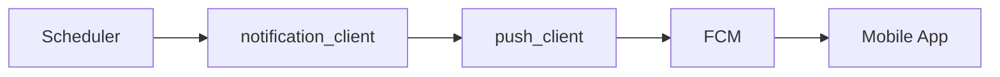

# 📬 Messaging - Notification System

> **Trinity's voice to the outside world.** Push notifications, scheduled messages, and i18n support via FCM.

---

## 📁 Complete Structure (9 files, ~80KB)

```
social/messaging/
├── scheduler.py             # Main scheduler (27KB, 647 lines)
├── notification_templates.py # Message templates (19KB)
├── i18n.py                  # Internationalization (12KB)
├── notification_client.py   # FCM client (10KB)
├── push_client.py           # Low-level push (6KB)
├── nerve_relay.py           # Nerve signal relay
├── mobile.py                # Mobile helpers
├── ascii.py                 # ASCII art formatting
└── __init__.py
```

---

## 🧠 TrinityScheduler

**647 lines** - The heart of Trinity's daily rhythms:

```python
class TrinityScheduler:
    """Gère les cycles circadiens et routines autonomes."""
    
    # Daily Schedule
    async def boot_sequence(self):    # Startup reports
    async def morning_reflection(self): # 6:00 - Auto-evolution
    async def wakeup(self):           # 8:00 - Morning briefing
    async def noon_check(self):       # 12:00 - Midday status
    async def nightly_council(self):  # 05:00 - Jules PRs
    async def night_mode(self):       # 22:00 - Night summary
```

### Job Hooks
Jobs register callbacks for lifecycle events:

```python
register_startup_hook(trader.on_startup)
register_report_hook(trader.generate_report)
```

---

## 📱 Notification Flow



### notification_client.py
High-level API for sending messages:

```python
async def notify(
    title: str,
    message: str,
    source: str = "TRINITY",
    dedup_key: str = None
):
    # Deduplication, templating, then push
```

### push_client.py
Low-level FCM integration:

```python
async def send_fcm(token: str, payload: dict):
    # Direct Firebase Cloud Messaging
```

---

## 🌍 Internationalization (i18n)

Trinity speaks **French** and **English**:

```python
# i18n.py
def t(key: str, **kwargs) -> str:
    """Translate key with language from config."""
    lang = get_language()  # "fr" or "en"
    return TRANSLATIONS[lang][key].format(**kwargs)
```

---

## 📝 Notification Templates

Pre-built message formats (19KB):

```python
def render_lifecycle_event(event_type: str, data: dict) -> str:
    """
    Event types:
    - boot: Trinity startup
    - trade_executed: Trader activity
    - video_published: YouTuber success
    - mention_replied: Influencer action
    """
```

---

## 🔗 Nerve Relay

Bridges `corpus.soma.nerves` to push notifications:

```python
def on_nerve_signal(signal: str, level: str, message: str):
    if level in ["PAIN", "ALERT"]:
        await notify(title=signal, message=message)
```

---

> **Key Insight**: The Messaging module transforms Trinity's internal signals into human-readable notifications, respecting circadian rhythms and user language preferences.
