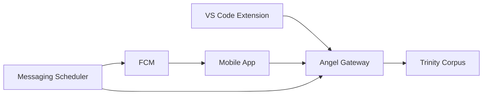

# 🌐 Social - User Interfaces & Communication

> **Trinity's public face.** All user-facing interfaces: mobile app, VS Code extension, and notification system.

---

## 🏛️ Architectural Principle

```
social/
├── extension/   ← VS Code control center
├── messaging/   ← Push notifications & scheduling
└── web/         ← React app + Android mobile
```

**Rule**: Social modules are the interface layer. They communicate with the Corpus via Angel (HTTP gateway).

---

## 📊 Overview

| Module | Purpose | Technology | Doc |
|--------|---------|------------|-----|
| [**Extension**](EXTENSION.md) | VS Code control | TypeScript | ✅ |
| [**Messaging**](MESSAGING.md) | Notifications | Python/FCM | ✅ |
| [**Web**](WEB.md) | Mobile/Web app | React/Capacitor | ✅ |

---

## 🛸 Extension (VS Code)

**~20 files** - The Creator's neural control center.

### Key Features
- Real-time telemetry (CPU, RAM, hormones)
- Process control (start/stop/restart)
- AI whispers feed
- Jules integration

### Structure
```
extension/
├── src/
│   ├── extension.ts         # Main (16KB)
│   ├── core/TrinityClient.ts # API client
│   └── services/ProcessManager.ts # Control (25KB)
└── webview-ui/              # React UI
```

📄 [Full Documentation](EXTENSION.md)

---

## 📬 Messaging (Notifications)

**9 files, ~80KB** - Trinity's voice to the outside world.

### Key Features
- Circadian scheduler (boot, 6h, 8h, 12h, 22h)
- FCM push notifications
- i18n (French/English)
- Nerve signal relay

### Structure
```
messaging/
├── scheduler.py             # Main (27KB, 647L)
├── notification_templates.py # Templates (19KB)
├── i18n.py                  # Translations (12KB)
└── notification_client.py   # FCM client
```

📄 [Full Documentation](MESSAGING.md)

---

## 📱 Web & Mobile

**~50+ files** - React/Vite app with Capacitor Android.

### Key Features
- Dual mode (web + mobile)
- 13 component modules
- Play Store deployment
- Bilingual support

### Structure
```
web/
├── src/
│   ├── MobileApp.jsx        # Mobile (18KB)
│   ├── components/          # 13 modules
│   └── services/            # API clients
└── android/                 # Capacitor native
```

📄 [Full Documentation](WEB.md)

---

## 🔗 Integration Flow



---

## 📊 Statistics

| Module | Files | Code Size | Largest File |
|--------|-------|-----------|--------------|
| Extension | ~20 | ~80KB | ProcessManager.ts (25KB) |
| Messaging | 9 | ~80KB | scheduler.py (27KB) |
| Web | ~50+ | ~150KB | MobileApp.jsx (18KB) |
| **Total** | **~80** | **~310KB** | - |

---

> **Key Insight**: The Social layer transforms Trinity's internal state into human-accessible interfaces, maintaining consistency across VS Code, mobile, and push notifications.
