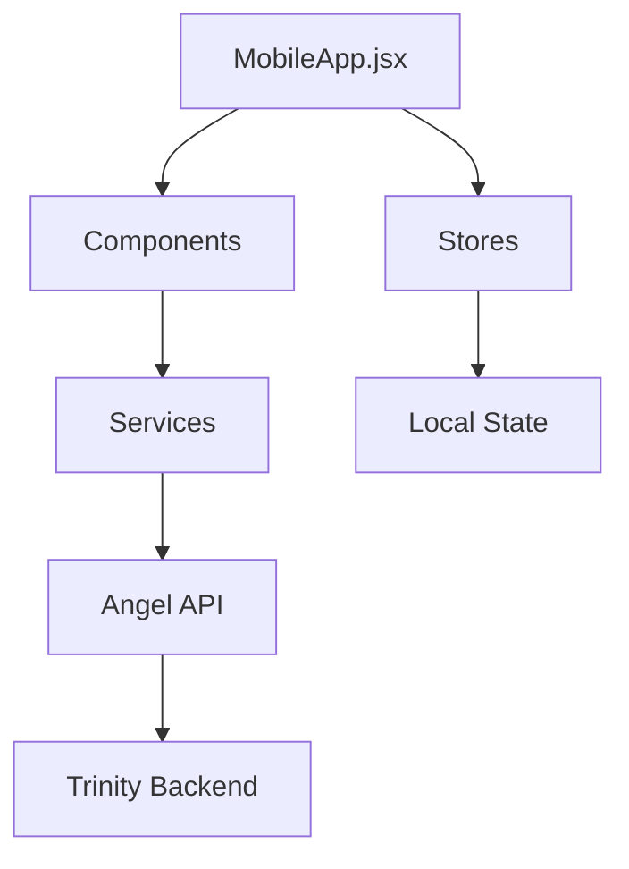

# 📱 Web & Mobile App - Trinity Dashboard

> **Trinity's face to the world.** A React/Vite app with Capacitor for Android deployment.

---

## 📁 Complete Structure

```
social/web/
├── src/
│   ├── MobileApp.jsx         # Main mobile app (18KB)
│   ├── App.jsx               # Web app (11KB)
│   ├── main.jsx              # Entry point
│   ├── index.css             # Global styles (6KB)
│   │
│   ├── components/           # 13 feature modules
│   │   ├── core/             # Core UI components
│   │   ├── auth/             # Authentication
│   │   ├── chat/             # AI chat interface
│   │   ├── console/          # System console
│   │   ├── notifications/    # Push notifications
│   │   ├── trader/           # Trading dashboard
│   │   ├── youtuber/         # Video production
│   │   ├── influencer/       # Social media
│   │   ├── jules/            # Jules integration
│   │   ├── hud/              # Heads-up display
│   │   ├── layout/           # Layout components
│   │   └── ui/               # UI primitives
│   │
│   ├── services/             # API clients
│   ├── stores/               # State management
│   ├── hooks/                # React hooks
│   ├── locales/              # i18n translations
│   ├── logic/                # Business logic
│   └── config/               # Configuration
│
├── android/                  # Capacitor Android
│   ├── app/
│   │   ├── build.gradle      # Build config
│   │   ├── release.keystore  # Signing key
│   │   └── src/              # Java sources
│   ├── gradle/               # Gradle wrapper
│   └── capacitor-cordova-android-plugins/
│
├── public/                   # Static assets
├── assets/                   # Media files
├── scripts/                  # Build scripts
│
├── capacitor.config.json     # Capacitor config
├── vite.config.js            # Vite bundler
└── package.json              # Dependencies
```

---

## 🔥 Key Features

### 1. Dual Mode App
- **Web**: Full dashboard via `App.jsx`
- **Mobile**: Optimized via `MobileApp.jsx` (18KB)

### 2. Component Modules

| Module | Purpose |
|--------|---------|
| `trader/` | Live trading dashboard |
| `youtuber/` | Video production controls |
| `influencer/` | Social media panel |
| `jules/` | Autonomous dev monitoring |
| `chat/` | AI conversation interface |
| `notifications/` | Push notification feed |
| `console/` | System logs viewer |

### 3. Android Deployment
Capacitor-based Android app:

```bash
# Build and deploy
npm run build
npx cap sync android
cd android && ./gradlew assembleRelease
```

---

## 🧠 Architecture



### Services Layer
```
src/services/
├── angelService.js    # Angel API client
├── authService.js     # Authentication
└── notificationService.js  # FCM
```

### State Management
```
src/stores/
├── trinityStore.js    # Global state
└── userStore.js       # User preferences
```

---

## 📱 Android Specifics

### Build Configuration
```gradle
// android/app/build.gradle
android {
    defaultConfig {
        applicationId "fr.julienpiron.trinity"
        versionCode 136
        versionName "2.5.18"
    }
}
```

### Signing
Release builds use `release.keystore` for Play Store deployment.

---

## 🌍 Internationalization

```
src/locales/
├── en.json    # English
└── fr.json    # French
```

---

> **Key Insight**: The web app unifies all Trinity interfaces into a single React application, deployable as web or native Android via Capacitor.
